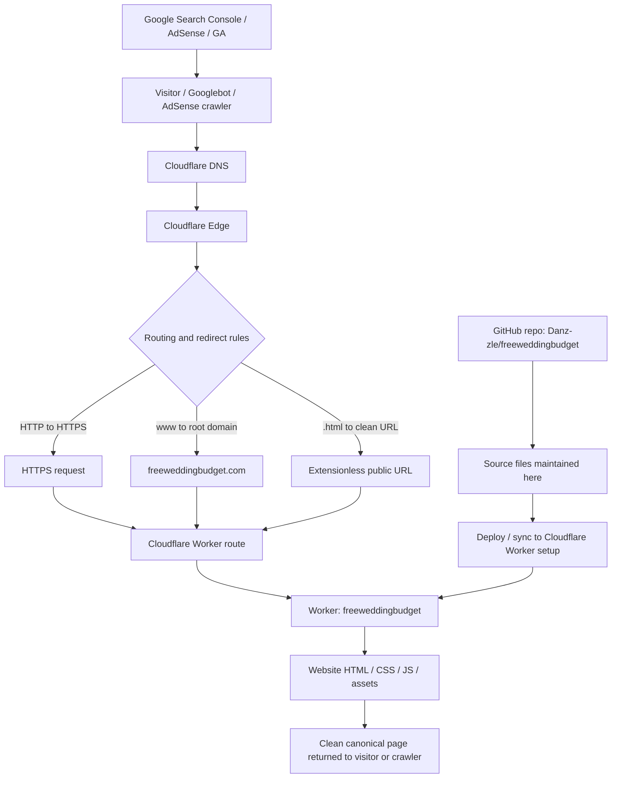

# Free Wedding Budget Planner

A lightweight global English wedding budget planner and wedding budgeting resource site.

Website: https://freeweddingbudget.com  
Repository: https://github.com/Danz-zle/freeweddingbudget

---

## Project purpose

Free Wedding Budget Planner is a personal, transparent, low-budget project by **Dan. Liu / Wedding Budget Planner**.

The site is positioned as a **global English wedding budget planner**. It uses USD examples for clarity, but it should not claim to be US-only.

The current main goal is to recover from repeated Google AdSense **Low value content** rejections and prepare the site for a safer AdSense review.

---

## Current recovery status

### AdSense

- Previous rejection reason: **Low value content**.
- Rejected multiple times before the cleanup work.
- AdSense review was requested again on **Jun 29, 2026** after the main cleanup and monitoring period.
- Site ownership in AdSense is verified.
- Do not repeatedly click review or make large changes while waiting for the result.

Important IDs:

```txt
authorized ads.txt line:
google.com, pub-4504023199353060, DIRECT, f08c47fec0942fa0

AdSense publisher ID:
pub-4504023199353060

AdSense client:
ca-pub-4504023199353060

Ad slot:
7437035292
```

AdSense may sometimes show **ads.txt: Not found** even when the live file is accessible. Before changing anything, verify the live file first:

```txt
https://freeweddingbudget.com/ads.txt
```

If the file opens and shows the correct line, do **not** change ads.txt immediately. Treat the AdSense dashboard status as possibly stale until confirmed otherwise.

---

## Main rule while waiting for AdSense

**Do not change code unless something is clearly broken.**

Avoid unnecessary changes to:

- AdSense code
- ads.txt
- sitemap.xml
- robots.txt
- canonical tags
- internal URL structure
- Cloudflare redirects
- Cloudflare WAF/security rules
- major layout/design

The site needs stability for crawling and AdSense review.

---

## Site positioning rules

Keep the site identity honest and simple:

- Author/site identity: **Dan. Liu / Wedding Budget Planner**
- No fake company
- No fake address
- No fake team
- No fake LinkedIn
- No fake wedding planner certification
- No fake professional wedding planner claim
- Keep the tone personal, transparent, and helpful
- Keep the site global English, not US-only
- USD examples are okay for clarity

---

## Current sitemap URLs

The sitemap should contain **15 clean extensionless URLs**:

```txt
https://freeweddingbudget.com/
https://freeweddingbudget.com/blog
https://freeweddingbudget.com/blog-create-budget
https://freeweddingbudget.com/blog-diy-decor
https://freeweddingbudget.com/blog-spend-vs-save
https://freeweddingbudget.com/blog-hidden-costs
https://freeweddingbudget.com/blog-average-cost-2026
https://freeweddingbudget.com/blog-planning-timeline
https://freeweddingbudget.com/blog-50-vs-100-guests
https://freeweddingbudget.com/blog-venue-cost-checklist
https://freeweddingbudget.com/blog-catering-budget-guide
https://freeweddingbudget.com/blog-vendor-quotes
https://freeweddingbudget.com/about
https://freeweddingbudget.com/privacy
https://freeweddingbudget.com/terms
```

Do not re-add `.html` URLs into the sitemap.

---

## URL and canonical setup

Current intended behavior:

- HTTP redirects to HTTPS.
- `www.freeweddingbudget.com` redirects to root domain `freeweddingbudget.com`.
- Public URLs are clean extensionless URLs.
- Actual source files may still be `.html` in GitHub.
- Cloudflare serves clean extensionless URLs.
- Sitemap uses extensionless URLs.
- Canonical tags use extensionless URLs.
- JSON-LD `url` and `mainEntityOfPage` use extensionless URLs.
- Internal links use extensionless URLs.

Known verified examples from cleanup:

```txt
https://www.freeweddingbudget.com/blog
→ 301 → https://freeweddingbudget.com/blog → 200

https://freeweddingbudget.com/blog.html
→ 307 → /blog → 200

/blog canonical:
<link rel="canonical" href="https://freeweddingbudget.com/blog">

/blog-create-budget canonical:
<link rel="canonical" href="https://freeweddingbudget.com/blog-create-budget">

/blog-catering-budget-guide canonical:
<link rel="canonical" href="https://freeweddingbudget.com/blog-catering-budget-guide">
```

---

## Hosting and traffic flow

This project currently uses **GitHub as the source repository** and **Cloudflare Worker as the live origin/serving layer**. Cloudflare sits in front of the domain and handles DNS, HTTPS, redirects, cache, and security.

### Simple map chart



### Current Cloudflare DNS records

Based on the current Cloudflare DNS setup:

| Hostname | Type | Target / content | Proxy status | Purpose |
|---|---|---|---|---|
| `freeweddingbudget.com` | TXT | `google-site-verification=...` | DNS only | Google site verification |
| `freeweddingbudget.com` | Worker | `freeweddingbudget` | Proxied | Apex/root site served by Worker |
| `www.freeweddingbudget.com` | Worker | `freeweddingbudget` | Proxied | www hostname routed to same Worker before redirecting to root |

Cloudflare shows the Worker as the origin for these hostnames. That means the live site is not using a traditional origin server in the normal DNS sense.

### Intended request flow

1. A visitor, Googlebot, or AdSense crawler requests the site.
2. Cloudflare DNS receives the request for `freeweddingbudget.com` or `www.freeweddingbudget.com`.
3. Cloudflare routes the request to the Worker named `freeweddingbudget`.
4. Redirect behavior normalizes the URL:
   - HTTP becomes HTTPS.
   - `www` becomes root domain.
   - `.html` URLs become clean extensionless URLs.
5. The Worker/site returns the correct HTML, CSS, JavaScript, images, `ads.txt`, `robots.txt`, or `sitemap.xml`.
6. The final public page should have a clean canonical URL.

### Final public URL format

Use this format publicly:

```txt
https://freeweddingbudget.com/page-name
```

Avoid using these as final public URLs:

```txt
http://freeweddingbudget.com/page-name
https://www.freeweddingbudget.com/page-name
https://freeweddingbudget.com/page-name.html
```

Those variants should redirect to the clean HTTPS root-domain version.

### Troubleshooting order

If something breaks, check in this order:

1. GitHub source files
2. Cloudflare Worker deployment / route
3. Cloudflare DNS records
4. Cloudflare redirect rules
5. Live public URL response
6. Canonical tag
7. `sitemap.xml`
8. `robots.txt`
9. `ads.txt`
10. GSC / AdSense / GA status

---

## Google Search Console notes

Current expected healthy signals:

- Sitemap status: **Success**
- Discovered pages: **15**
- Sitemap was submitted on **Jun 23, 2026**
- Sitemap was later read again successfully, including **Jun 27, 2026**
- Some clean URLs are indexed
- Clean URLs are receiving early impressions

Old or stale indexing issues may still appear:

- Page with redirect
- Alternate page with proper canonical tag
- Redirect error
- Duplicate without user-selected canonical

These are likely old `.html`, `www`, redirect, or duplicate variants. Do not rush to change code unless a clean intended URL is affected.

Healthy example from inspection:

```txt
https://freeweddingbudget.com/blog-50-vs-100-guests
Status: URL is on Google
Page is indexed
Page fetch successful
Indexing allowed: yes
Google-selected canonical: Inspected URL
```

---

## Google Analytics notes

Recent GA signals around the review period:

- Active users: around 32
- New users: around 32
- Average engagement time: around 1m 14s
- Event count: around 255
- Traffic sources included:
  - Direct
  - Bing / organic
  - m.facebook.com / referral
- Country/city traffic included mostly US and some Singapore traffic
- Realtime may show 0 users if nobody is active in the last 30 minutes. That does not mean GA is broken.

Useful pages receiving traffic included:

- Blog hub
- Create budget guide
- Homepage/calculator
- Privacy page
- About page
- Catering guide
- 50 vs 100 guests guide

Do not change GA code unless tracking clearly breaks.

---

## Cloudflare notes

Cloudflare should remain conservative and AdSense-friendly.

Healthy signs seen during monitoring:

- Site load and cache performance looked healthy
- Requests and visitors increased after cleanup
- Sitemap and robots.txt were requested
- No major 5xx/403 issue observed
- No major security blocking observed

Do not enable aggressive security features before or during AdSense review:

- No Under Attack Mode
- No aggressive WAF rules
- No strict bot blocking
- No country blocking
- No JavaScript challenges for normal traffic
- Do not block unknown user agents just because they look unusual

### Existing Cloudflare AdSense bot custom rule

A custom rule named similar to **Allow Google AdSense Bots** exists/was tested.

Important note: the rule may not work as intended if it uses logic like:

```txt
cf.verified_bot_category eq "Search Engine Crawler"
AND
cf.verified_bot_category eq "Advertising & Marketing"
AND
http.user_agent contains "Mediapartners-Google"
```

A single request normally cannot have `cf.verified_bot_category` equal to two categories at the same time. This means the rule may match zero requests.

However, if the rule only uses **Skip** and is not blocking anything, it is probably not the reason AdSense ads.txt shows `Not found`.

Do not adjust Cloudflare rules during AdSense review unless logs prove Google/AdSense crawlers are blocked or challenged.

---

## Completed work summary

### Content rebuild

- Expanded from a simple calculator into calculator + blog resource site.
- Existing 6 blog posts were improved.
- Added 4 new high-value articles.
- Sitemap now has 15 pages.

### UI/content fixes

- Mobile blog byline squeezed issue fixed.
- Blog tables mobile truncation fixed.
- Homepage card/mobile horizontal scrolling fixed.
- Export/PDF/Excel/CSV redesigned.
- CSV renamed to **Export Expense CSV** and kept as raw ledger format.
- PDF report made more polished and wedding-style.
- Excel export includes 5 sheets:
  - Summary
  - Budget Allocation
  - Expense History
  - Guest Count
  - Smart Tips
- About page updated to **Dan. Liu**.
- Privacy and Terms titles changed to large bold h1.
- Blog images restored.
- Blog bylines restored.

---

## Export feature notes

The homepage planner includes export functions.

Current intended export behavior:

- CSV = raw expense ledger
- PDF = polished wedding-style report
- Excel = structured workbook with 5 sheets:
  - Summary
  - Budget Allocation
  - Expense History
  - Guest Count
  - Smart Tips

Do not rename or redesign these again unless there is a real bug or strong reason.

---

## Pre-review / post-review checklist

Before making any major change, check:

```txt
https://freeweddingbudget.com/
https://freeweddingbudget.com/blog
https://freeweddingbudget.com/ads.txt
https://freeweddingbudget.com/sitemap.xml
https://freeweddingbudget.com/robots.txt
```

Expected:

- Homepage loads normally
- Blog loads normally
- ads.txt returns the correct Google publisher line
- sitemap.xml lists 15 clean URLs
- robots.txt does not block important pages
- HTTP redirects to HTTPS
- www redirects to root domain

---

## How to judge future problems

Classify issues before changing code:

### Real problem needing action

- Clean sitemap URL returns 404/403/5xx
- Clean sitemap URL has wrong canonical
- ads.txt file is not accessible from browser/curl
- sitemap.xml is missing or wrong
- robots.txt blocks important pages
- Cloudflare blocks Googlebot/AdSense crawler
- AdSense reports a new clear technical/policy issue beyond Low value content

### Usually normal or stale

- GSC still lists old `.html` URLs
- GSC still lists old `www` variants
- GSC shows alternate page with canonical
- GSC shows page with redirect for old variants
- AdSense dashboard temporarily says ads.txt Not found while live ads.txt works
- GA Realtime shows 0 active users
- Cloudflare shows unknown/bot-like traffic but no blocking/errors

---

## Current operational advice

While waiting for AdSense review result:

1. Keep the site stable.
2. Do not keep editing pages daily.
3. Monitor GSC, GA, Cloudflare, and AdSense.
4. If AdSense rejects again, analyze the exact rejection reason first.
5. If the reason is still Low value content, improve content depth, originality, and user value carefully instead of making technical changes randomly.
6. If the reason changes to a technical issue, fix only that issue.

---

## Important reminder

This project recovered from a messy state involving content quality concerns, URL variants, redirects, canonicals, and AdSense review problems.

The safest strategy now is:

**Small fixes only. Stable site first. No unnecessary changes during AdSense review.**
